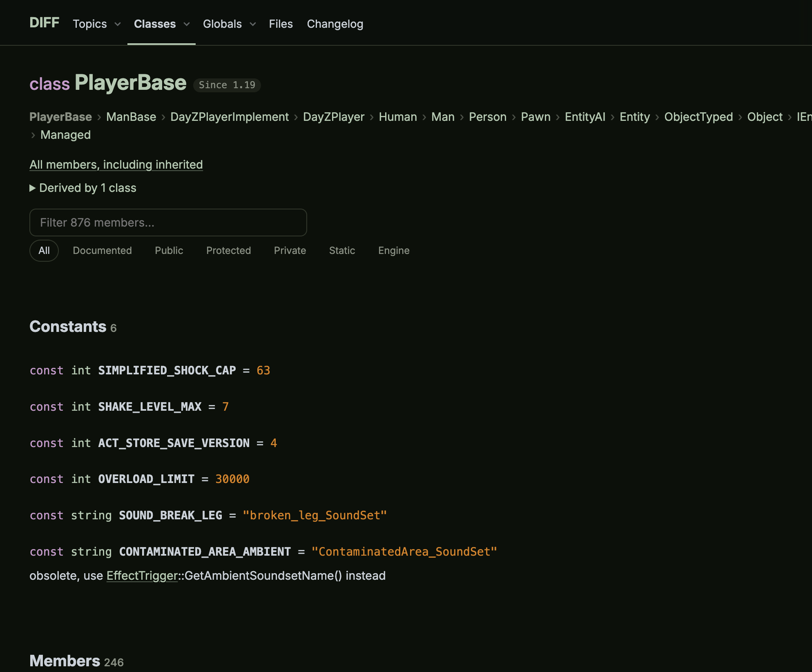
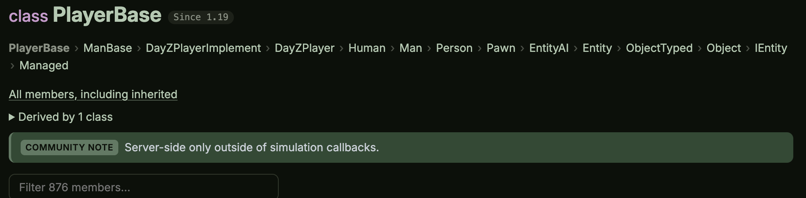

# DIFF — DayZ Scripts Documentation by YADZ

Browsable documentation for the DayZ scripts API (Enforce Script), generated
from the official
[DayZ Script Diff](https://github.com/BohemiaInteractive/DayZ-Script-Diff)
sources.

**Site:** [diff.yadz.app](https://diff.yadz.app) ·
**Contributing:** [CONTRIBUTING.md](CONTRIBUTING.md)

[](https://diff.yadz.app/classes/PlayerBase/)

Search, inheritance trees, syntax-highlighted sources, and a changelog across
every published PC stable build. Most of the API
has no official doc comment — the site shows where each member is used, and
[community notes](#community-notes) are where the rest can be written down.

## What's on the site

- [Classes](https://diff.yadz.app/classes/) — annotated list, [A–Z index](https://diff.yadz.app/classes/index/), [inheritance tree](https://diff.yadz.app/hierarchy/), and every inherited member on `/classes/<Name>/members/`
- [Topics](https://diff.yadz.app/topics/) — the `\defgroup` groups the sources wrap themselves into (math, physics, entities, widgets, …)
- [Files](https://diff.yadz.app/files/) — the script tree, plus [globals](https://diff.yadz.app/globals/) declared outside a class
- [Changelog](https://diff.yadz.app/changelog/) — API diff between any two builds
- [Feed](https://diff.yadz.app/feed.xml) — new builds as they ship, as Atom; every class and enum page also unfolds its own build-by-build history

Older builds stay at `/v/<build>/…`. The PC stable changelog, official links and
community links are on the [homepage](https://diff.yadz.app/); the links
themselves are hand-maintained in `src/generate/content.js`. Bugs and
suggestions for this site: [YADZ Discord](https://discord.gg/nbrHqZCpA6).

## For language models

The HTML pages are for people. Agents should start at
[`/llms.txt`](https://diff.yadz.app/llms.txt) and fetch the JSON rather than
scraping class pages.

- [`/api.json`](https://diff.yadz.app/api.json) — latest build: every class, method, field, enum, global, typedef and macro, with signatures, inheritance, file locations and doc briefs
- [`/search.json`](https://diff.yadz.app/search.json) — compact name index the site search uses
- [`/assets/notes.json`](https://diff.yadz.app/assets/notes.json) — community notes, keyed by `Type` or `Type.Member`
- [`/assets/versions.json`](https://diff.yadz.app/assets/versions.json) — every documented PC build

`api.json` is latest-only. The script sources it describes are under the DPL;
community notes are not.

For pasting into a chat by hand, every class and enum page has a
**Copy for LLM** button under its title: the page as Markdown — signatures,
inheritance, docs and community notes — with its build and source named.

## Community notes

A community note is a short annotation on a class, enum, or member. Add it to
`site/notes.json`, keyed by type name or `Type.Member`:

```json
{
  "PlayerBase": "Server-side only outside of simulation callbacks.",
  "PlayerBase.SetQuantity": "Clamps to the config maximum instead of failing; read it back with `GetQuantity()`."
}
```

[](https://diff.yadz.app/classes/PlayerBase/)

Edit that file and open a pull request. `Type.Member` covers every overload of
that name; enum values key off the value name; backticks render as code. Notes
show up on class and enum pages, labelled as community writing, on every build
at once.

`test/api.test.js` rejects a key that is not `Type` or `Type.Member`, an empty
value, or an unclosed backtick.

## Local development

Requires Node.js 20+ and git. No npm dependencies.

```sh
npm run fetch            # clone/update upstream, detect versions
npm run parse            # parse all versions into JSON models (cached by commit)
npm run dev              # http://localhost:3000 — render on demand, reload on save
npm run generate         # write the static site into dist/
npm run generate:latest  # newest build only
npm run generate:verify  # re-render reused pages and fail if one changed
npm run build            # fetch, parse and generate
npm run preview          # serve a real dist/ at http://localhost:3000
npm test
```

`npm run dev` is the inner loop. It needs `fetch` and `parse`, not `generate`.
It loads the newest build once and renders whichever page you open; older
builds work the same at `/v/<build>/`. Assets come straight from `site/`.

Use `npm run preview` to check archive rewrites, redirects and the sitemap.
After changing the parser, re-run with `FORCE_PARSE=1 npm run parse` (or
`ONLY_VERSION=1.29` for one build) so the commit-sha cache is not reused.
`LINK_THREADS` overrides how many threads do the filesystem writes.

The pipeline is `src/fetch.js` → `src/parse-all.js` → `src/generate/` (or
`src/dev.js` in development). `src/generate/routes.js` is the site map both
the writer and the dev server read. Page reuse, source links and the
Enforce Script parser are documented in the files that implement them.

[CONTRIBUTING.md](CONTRIBUTING.md) maps the rest: which file renders which
URL, where the client-side behaviour lives, and the invariants to keep.

When a new PC stable ships, add its forum thread (if it has one) in
`src/generate/content.js`. Builds without a thread still appear.

## Deployment

`.github/workflows/build.yml` runs on a daily schedule, on push, and on
manual dispatch. It skips when upstream has no new commit; otherwise it
fetches, parses, and commits `data/`. That commit is what triggers Netlify
to run `npm run build` and deploy.

## License

**This generator** (`src/`, `site/`, `test/`, and the build configuration) is
[MIT](LICENSE). Community notes in `site/notes.json` are original writing and
covered by the same license.

**The generated documentation** — the DayZ script sources in `data/` (tracked)
and `dist/` (not tracked) — is © BOHEMIA INTERACTIVE a.s. and licensed under
the
[DayZ Public License (DPL)](https://www.bohemia.net/community/licenses/dayz-public-license-dpl):
non-commercial, DayZ-only reuse with attribution. They are modified here only
for presentation, from
[DayZ Script Diff](https://github.com/BohemiaInteractive/DayZ-Script-Diff/tree/main/scripts),
and are offered as-is. MIT does not extend to them.
(`src/generate/pathnames.json` holds file and directory names only, so the
site can spell paths the way the game does.)

This is not official documentation and is not affiliated with DayZ or Bohemia
Interactive. DAYZ®, ENFUSION®, and BOHEMIA INTERACTIVE® are registered
trademarks of BOHEMIA INTERACTIVE a.s.
